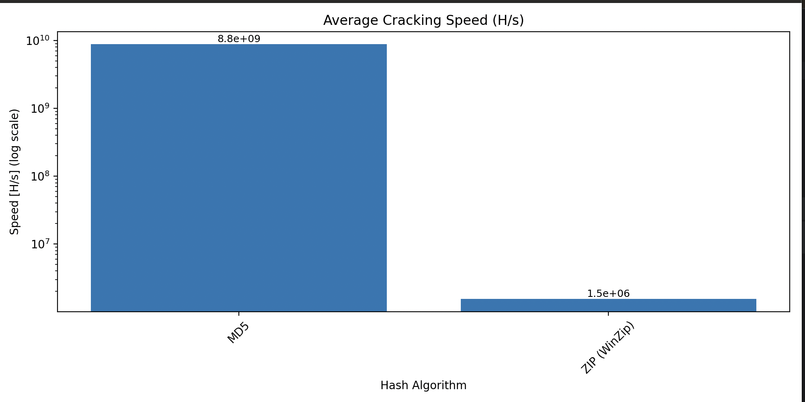

# Hashcat 7.0 on Apple M3 – Benchmark & Feature Tests

This project provides a scientific and automated approach to benchmarking the newly
released [Hashcat v7.0.0](https://github.com/hashcat/hashcat) on Apple Silicon (M3). It focuses on real-world
performance, feature testing (such as auto hash detection and Python Bridge), and visualization of results.

## 🔧 Installing Hashcat v7.0.0 on macOS (Apple Silicon)

### ⚠️ Enabling GPU Support on Apple Silicon (M1/M2/M3)

By default, Hashcat on macOS does **not detect the GPU** properly after building from source.  
If you run `hashcat -I` too early, you may see this error:

```bash
/usr/local/share/hashcat/OpenCL/: No such file or directory
````

This is because Hashcat expects the OpenCL runtime (`libOpenCL.dylib`) to be available in a specific directory that
isn't created or linked by default.

Even though Homebrew installs `opencl-icd-loader`, it does **not** place the dynamic library where Hashcat looks for
it (`/usr/local/share/hashcat/OpenCL/`).

To fix this, you'll need to:

- Create the expected directory manually
- Symlink the `libOpenCL.dylib` from Homebrew’s installation location
- Then re-run `hashcat -I` to confirm that the Apple GPU is correctly detected via OpenCL

The following instructions walk you through the complete setup process.

---

```bash
# 1. Install required tools and OpenCL loader
brew install cmake git pocl opencl-icd-loader

# 2. Clone and build Hashcat from source
git clone https://github.com/hashcat/hashcat.git
cd hashcat
make -j$(sysctl -n hw.ncpu)

# 3. Install Hashcat and modules globally
sudo make install

# 4. Create OpenCL directory Hashcat expects at runtime
sudo mkdir -p /usr/local/share/hashcat/OpenCL/

# 5. Manually link the OpenCL dynamic library
#    This path comes from where Homebrew installs opencl-icd-loader
#    You can confirm its exact location with:
#    find /opt/homebrew -name "libOpenCL.dylib"

sudo ln -s /opt/homebrew/Cellar/opencl-icd-loader/*/lib/libOpenCL.dylib /usr/local/share/hashcat/OpenCL/libOpenCL.dylib

# 6. Verify that devices are detected
hashcat -I

# Expected output should include Apple Metal and OpenCL info like:
# Name...........: Apple M3 Pro
# OpenCL Version.: OpenCL 1.2
# Memory.Total...: 27648 MB

# 7. Test with a basic benchmark
hashcat -b -m 0 --force
# Expected output:
# hashcat (v7.0.0-4-g9727714cf) starting in benchmark mode
# 
# Benchmarking uses hand-optimized kernel code by default.
# You can use it in your cracking session by setting the -O option.
# Note: Using optimized kernel code limits the maximum supported password length.
# To disable the optimized kernel code in benchmark mode, use the -w option.
# 
# You have enabled --force to bypass dangerous warnings and errors!
# This can hide serious problems and should only be done when debugging.
# Do not report hashcat issues encountered when using --force.
# 
# METAL API (Metal 368.12)
# ========================
# * Device #01: Apple M3 Pro, skipped
# 
# OpenCL API (OpenCL 1.2 (Apr 18 2025 21:46:03)) - Platform #1 [Apple]
# ====================================================================
# * Device #02: Apple M3 Pro, GPU, 13824/27648 MB (2592 MB allocatable), 18MCU
# 
# Benchmark relevant options:
# ===========================
# * --force
# * --backend-devices-virtmulti=1
# * --backend-devices-virthost=1
# * --optimized-kernel-enable
# 
# -------------------
# * Hash-Mode 0 (MD5)
# -------------------
# 
# Speed.#02........:  8795.3 MH/s (6.98ms) @ Accel:544 Loops:1024 Thr:256 Vec:1
# 
# Started: Sat Aug  2 13:30:45 2025
# Stopped: Sat Aug  2 13:30:57 2025
```

## 🧪 Project Goals

- Benchmark selected popular hash algorithms (e.g., MD5, SHA1, bcrypt, scrypt, Argon2, WPA2)
- Validate hashcat behavior and compatibility on Apple M3 hardware
- Support benchmarking both native and bridged modes (e.g., Argon2 mode 70000)
- Evaluate and log:
  - Hashcat’s `--identify` feature (planned)
  - Assimilation Bridge support
  - Python integration (via benchmarking script)
- Automate:
  - Selection of algorithms from config
  - Execution of benchmarks using hashcat
  - CSV result export and log-scale plotting

---

## 📁 Project Structure


```
.
hashcat-m3-tests/
├── benchmark.py              # Main benchmarking script
├── plot_results.py           # Script to generate log-scale speed plots
├── config/
│ ├── algorithms.yaml         # User-defined list of hash algorithms to test
│ └── test_load_config.py     # Config parsing test
├── results.csv               # Collected raw benchmark data
├── results.png               # Generated graph based on results
├── requirements.txt          # Python dependencies
└── README.md                 # Project documentation
```

## ⚙️ Setup

```bash
git clone https://github.com/CamilYed/hashcat-m3-tests.git
cd hashcat-m3-tests
python3 -m venv .venv
source .venv/bin/activate
pip install -r requirements.txt
```

Make sure you have Hashcat 7.0 installed:

```bash
brew install hashcat
# or build from source
```

## 🚀 Run Benchmarks

```bash
# Run benchmark interactively (loads config/algorithms.yaml or allows manual selection)
python benchmark.py

# Plot the results saved in results.csv
python plot_results.py
```

## 📊 Outputs

- CSV file with speeds and durations
  ```csv
  name,mode,speed_raw,speed_hps,duration
  MD5,0,8795.3 MH/s (6.98ms) @ Accel,8795300000.0,8.26
  ```
- PNG chart comparing average performance per hash mode

Example chart:


## 🛡️ Security Reminder

- Use strong, unique passwords
- Enable 2FA wherever possible
- Store credentials in a secure password manager

---

> Work in progress – contributions and feedback welcome!
